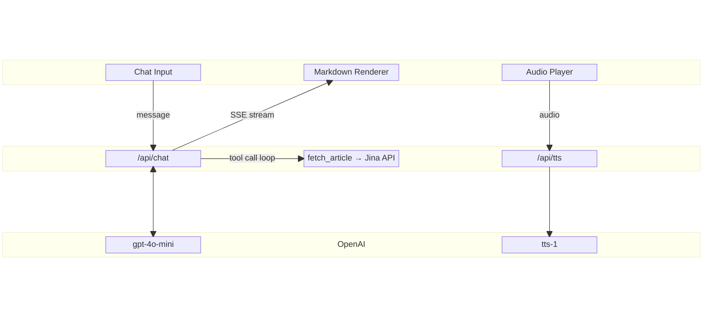

# News Summarizer AI

A sleek, real-time AI chatbot that summarizes news articles and reads them aloud — powered by OpenAI, built with Next.js.


---

## What It Does

**Drop in a news article URL** and the chatbot will fetch, read, and summarize it for you — in real time. Want to listen instead? Hit play and let it read the summary out loud.

### Features

- **Streaming responses** — answers appear token-by-token via Server-Sent Events, no waiting for the full response
- **Article summarization** — paste any news article URL and get an instant AI-generated summary
- **Text-to-speech** — every assistant message can be played as audio with a built-in waveform player
- **Markdown rendering** — rich formatting with headings, code blocks, tables, and more
- **Dark mode** — full light/dark theme support

## How It Works



## Tech Stack

| Layer     | Technology                                      |
|-----------|--------------------------------------------------|
| Framework | Next.js 16 (App Router)                          |
| Frontend  | React 19, TypeScript                             |
| Styling   | Tailwind CSS v4, Radix UI, shadcn/ui             |
| AI        | OpenAI SDK (`gpt-4o-mini` + `tts-1`)             |
| Extraction| Jina API for article content                     |
| Package Manager   | pnpm                                             |

## Getting Started

### Prerequisites

- Node.js 18+
- pnpm
- An [OpenAI API key](https://platform.openai.com/api-keys)

### Setup

```bash
# Clone the repo
git clone https://github.com/berohlfs/ai-chatbot.git
cd ai-chatbot/my-app

# Install dependencies
pnpm install

# Set up environment variables
cp .env.example .env
```

Add your OpenAI API key to `.env`:

```
OPEN_AI_KEY=sk-...
```

### Run

```bash
pnpm dev
```

Open [http://localhost:3000](http://localhost:3000) and start chatting.

## Project Structure

```
my-app/
├── app/
│   ├── api/
│   │   ├── chat/route.ts        # Streaming chat endpoint
│   │   └── tts/route.ts         # Text-to-speech endpoint
│   ├── components/
│   │   ├── chat.tsx              # Main chat UI
│   │   ├── chat-message.tsx      # Message rendering (markdown)
│   │   ├── chat-input.tsx        # User input
│   │   ├── audio-context.tsx     # Audio state management
│   │   ├── audio-player.tsx      # Waveform audio player
│   │   └── fetch-article.ts     # Jina API integration
│   ├── layout.tsx
│   ├── page.tsx
│   └── globals.css
├── components/ui/                # shadcn/ui primitives
└── lib/utils.ts
```
